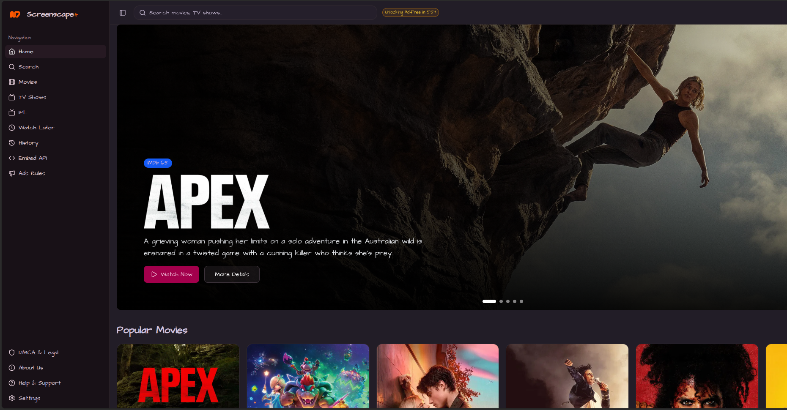

# 🎬 ScreenScape Providers Repository

<div align="center">

[](https://screenscape.me)
[](https://github.com/Anshu78780/ScarperApi)
[](#providers-list)

**Official provider configuration repository for [ScreenScape](https://screenscape.me) - Your ultimate streaming companion**

### 🌐 Now Available on Web!

<div align="center">

</div>

</div>

---

## 📋 Table of Contents

- [Overview](#-overview)
- [Repository Structure](#-repository-structure)
- [Providers List](#-providers-list)
- [Usage](#-usage)
- [Configuration Files](#-configuration-files)
- [Integration](#-integration)
- [Contributing](#-contributing)
- [Related Repositories](#-related-repositories)
- [Disclaimer](#-disclaimer)

---

## 🌟 Overview

This repository contains the provider configurations for **ScreenScape**, a powerful streaming aggregator application. It maintains a curated list of content providers and necessary authentication data to enable seamless content discovery and streaming across multiple sources.

### What is ScreenScape?

ScreenScape is a modern streaming platform aggregator that allows users to discover and watch content from various sources through a unified interface. Now available on **web**! Visit [screenscape.me](https://screenscape.me) to experience it yourself!

### Purpose

This repository serves as the **single source of truth** for:
- 🔗 Provider URLs and configurations
- 🍪 Authentication cookies and tokens
- 🔄 Dynamic provider updates without app redeployment
- 🌐 Multi-source content aggregation

---

## 📁 Repository Structure

```
json/
├── providers.json    # List of all content providers and their configurations
├── cookies.json      # Authentication cookies for provider access
└── README.md         # This file
```

---

## 🎯 Providers List

This repository currently supports **40+ content providers** across various categories:

### 🎥 Movie Providers

| Provider | URL | Status |
|----------|-----|--------|
| Moviesmod | [moviesmod.plus](https://moviesmod.plus) | ✅ Active |
| Topmovies | [moviesleech.net](https://moviesleech.net) | ✅ Active |
| UhdMovies | [uhdmovies.rip](https://uhdmovies.rip) | ✅ Active |
| Vegamovies | [vegamovies.gripe](https://vegamovies.gripe) | ✅ Active |
| MoviesDrive | [moviesdrive.pics](https://moviesdrive.pics/) | ✅ Active |
| MultiMovies | [multimovies.network](https://multimovies.network) | ✅ Active |
| KatMoviesHD | [katmoviehd.observer](https://katmoviehd.observer) | ✅ Active |
| TheMoviesFlix | [themoviesflix.you](https://themoviesflix.you) | ✅ Active |
| YoMovies | [yomovies.forum](https://yomovies.forum/) | ✅ Active |
| Movies4u | [movies4u.rip](https://movies4u.rip/) | ✅ Active |
| Movies4u2 | [movies4u.uz](https://movies4u.uz) | ✅ Active |
| SRMovies | [ssrmovies.deals](https://ssrmovies.deals) | ✅ Active |
| ZinkMovies | [zinkmovies.guru](https://zinkmovies.guru/) | ✅ Active |
| OggMovies | [ogomovies.dad](https://ogomovies.dad/) | ✅ Active |

### 🎬 HD Content Providers

| Provider | URL | Status |
|----------|-----|--------|
| HDHub4u | [hdhub4u.pictures](https://hdhub4u.pictures) | ✅ Active |
| 4kHDHub | [4khdhub.fans](https://4khdhub.fans) | ✅ Active |
| SkyMoviesHD | [skymovieshd.mba](https://skymovieshd.mba) | ✅ Active |
| AllMoviesHub | [allmovieshub.surf](https://allmovieshub.surf) | ✅ Active |

### 🌏 Regional & Specialty Providers

| Provider | URL | Status |
|----------|-----|--------|
| World4uFree | [world4ufree.bet](https://world4ufree.bet/) | ✅ Active |
| DesiReMovies | [desiremovies.group](https://desiremovies.group/) | ✅ Active |
| KMMovies | [kmmovies.sbs](https://kmmovies.sbs/) | ✅ Active |
| KissKh | [kisskh.ovh](https://kisskh.ovh) | ✅ Active |
| DramaFull | [dramafull.cc](https://dramafull.cc) | ✅ Active |
| Joya9TV | [joya9tv1.com](https://joya9tv1.com) | ✅ Active |
| TokyoInsider | [tokyoinsider.com](https://www.tokyoinsider.com) | ✅ Active |

### 🎭 Additional Providers

| Provider | URL | Status |
|----------|-----|--------|
| FilmyFly | [filmyfly.how](https://filmyfly.how/) | ✅ Active |
| FilmyClub | [filmycab.wtf](https://filmycab.wtf/) | ✅ Active |
| CinemaLuxe | [cinemalux.zip](https://cinemalux.zip/) | ✅ Active |
| Cinevood | [1cinevood.world](https://1cinevood.world/) | ✅ Active |
| ZeeFliz | [zeefliz.lat](https://zeefliz.lat/) | ✅ Active |

### 🔧 API & Streaming Services

| Provider | URL | Status |
|----------|-----|--------|
| NFMirror | [net20.cc](https://net20.cc) | ✅ Active |
| Rive | [watch.rivestream.app](https://watch.rivestream.app) | ✅ Active |
| Consumet | [consumet.zendax.tech](https://consumet.zendax.tech) | ✅ Active |

---

## 💻 Usage

### For Developers

1. **Clone the repository:**
   ```bash
   git clone https://github.com/Anshu78780/json.git
   cd json
   ```

2. **Access provider configurations:**
   ```javascript
   // Node.js example
   const providers = require('./providers.json');
   const cookies = require('./cookies.json');

   // Get specific provider
   const vegamovies = providers.Vega;
   console.log(vegamovies.url); // https://vegamovies.gripe
   ```

3. **Integrate with your application:**
   ```javascript
   // Fetch providers dynamically
   fetch('https://raw.githubusercontent.com/Anshu78780/json/main/providers.json')
     .then(response => response.json())
     .then(providers => {
       // Use providers in your app
     });
   ```

### For ScreenScape App

The ScreenScape app automatically fetches and updates provider configurations from this repository. No manual intervention required!

---

## ⚙️ Configuration Files

### `providers.json`

Contains the master list of all content providers with their metadata:

```json
{
  "providerKey": {
    "name": "Provider Display Name",
    "url": "https://provider-url.com"
  }
}
```

**Structure:**
- `providerKey`: Unique identifier for the provider (used internally)
- `name`: Human-readable name displayed in the app
- `url`: Base URL for the provider's website

### `cookies.json`

Stores authentication cookies required for accessing certain providers:

```json
{
  "cookies": "user_token=...; t_hash=...; t_hash_t=..."
}
```

**Security Note:** This file contains sensitive authentication data. Handle with care and rotate tokens regularly.

---

## 🔗 Integration

### With ScraperAPI

This repository works seamlessly with the [ScraperAPI](https://github.com/Anshu78780/ScarperApi) backend:

```
┌─────────────────┐
│  ScreenScape    │
│     App         │
└────────┬────────┘
         │
         ├──────────────┐
         │              │
┌────────▼────────┐ ┌──▼──────────────┐
│  Providers      │ │   ScraperAPI    │
│  Repository     │ │   Backend       │
│  (This Repo)    │ │                 │
└─────────────────┘ └─────────────────┘
```

**Workflow:**
1. App fetches provider list from this repository
2. User selects content from a provider
3. ScraperAPI handles scraping and content extraction
4. Content is delivered to the user through ScreenScape

---

## 🤝 Contributing

We welcome contributions to expand our provider network!

### Adding a New Provider

1. **Fork the repository**
2. **Edit `providers.json`:**
   ```json
   {
     "newProvider": {
       "name": "New Provider Name",
       "url": "https://newprovider.com"
     }
   }
   ```
3. **Test the provider** with the ScreenScape app
4. **Submit a Pull Request** with:
   - Provider name and URL
   - Brief description
   - Test results

### Guidelines

- ✅ Ensure the provider is accessible and working
- ✅ Use HTTPS URLs when available
- ✅ Follow the existing JSON structure
- ✅ Test thoroughly before submitting
- ❌ Do not add malicious or illegal content sources

---

## 📚 Related Repositories

- **[ScraperAPI](https://github.com/Anshu78780/ScarperApi)** - Backend API for content scraping and extraction
- **[ScreenScape Web](https://screenscape.me)** - The main web application

---

## ⚠️ Disclaimer

This repository is maintained for **educational and research purposes only**. 

- This project does not host, store, or distribute any copyrighted content
- All provider URLs are publicly available information
- Users are responsible for complying with their local laws and regulations
- The maintainers are not responsible for how this information is used
- Always respect copyright laws and terms of service of content providers

---

## 📞 Contact & Support

- **Website:** [screenscape.me](https://screenscape.me)
- **Issues:** [GitHub Issues](https://github.com/Anshu78780/json/issues)
- **API Support:** [ScraperAPI Repository](https://github.com/Anshu78780/ScarperApi)

---

<div align="center">

**Made with ❤️ for the ScreenScape Community**

⭐ Star this repository if you find it useful!

</div>